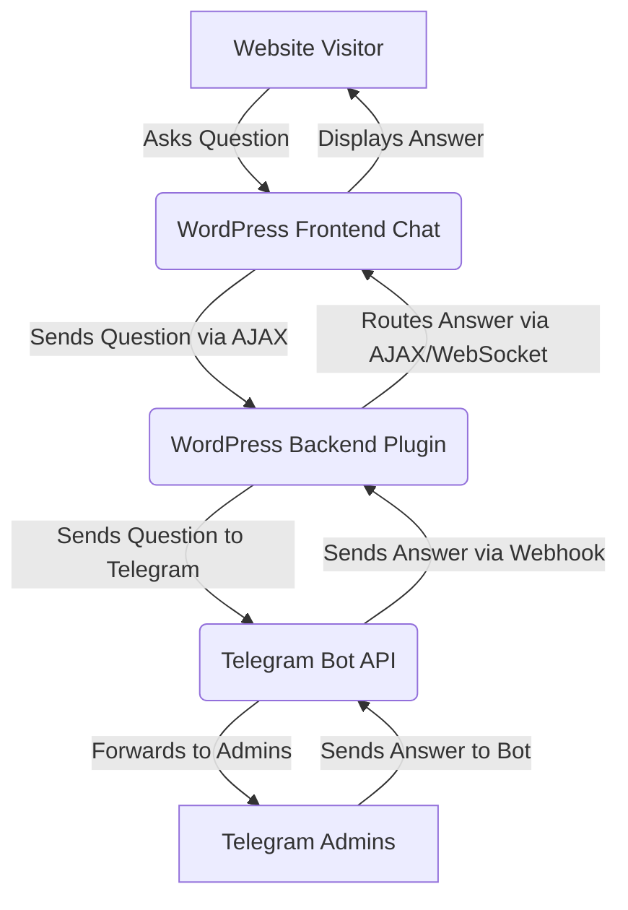

# WordPress Telegram Chat Plugin: Architecture and Design

## 1. Introduction

This document outlines the architecture and design considerations for a WordPress plugin that integrates a chat interface on the frontend with a Telegram bot on the backend. The primary goal is to enable website visitors to ask questions and receive private, targeted answers from designated Telegram administrators. A key challenge addressed in this design is ensuring that answers from Telegram are delivered only to the specific user who initiated the conversation on the website, maintaining strict user isolation.

## 2. Core Requirements

Before diving into the architecture, let's reiterate the core requirements:

*   **Frontend Chat Interface:** A user-friendly chat widget on the WordPress website, ideally positioned at the bottom right, allowing visitors to type and send questions.
*   **Telegram Bot Integration:** Seamless communication between the WordPress site and a Telegram bot.
*   **Admin Management:** A backend interface within WordPress for administrators to configure Telegram bot settings and manage a list of Telegram chat IDs (admins) who will receive questions.
*   **Question Routing:** Questions from website visitors must be routed to the configured Telegram admins.
*   **Private Responses:** Answers provided by Telegram admins must be sent *only* to the specific website user who asked the question, preventing cross-user communication.
*   **Downloadable Plugin:** The final output must be a complete, downloadable WordPress plugin.

## 3. High-Level Architecture

The plugin will consist of three main components:

1.  **WordPress Frontend:** The chat interface visible to website visitors.
2.  **WordPress Backend:** The core plugin logic, including admin settings, database interactions, and communication with the Telegram Bot API.
3.  **Telegram Bot:** The intermediary for sending questions to admins and receiving their responses.

## 4. Detailed Component Design

### 4.1. WordPress Frontend Chat Interface

*   **Technology:** HTML, CSS, JavaScript (potentially React or Vue.js for a more dynamic experience, but a simpler approach with vanilla JS and jQuery might suffice for initial implementation).
*   **Placement:** Fixed position at the bottom right of the screen.
*   **Functionality:**
    *   Input field for typing messages.
    *   Display area for chat history.
    *   Send button.
    *   Mechanism to uniquely identify the website visitor (e.g., a session ID or a temporary unique identifier stored in a cookie/local storage).
    *   AJAX calls to the WordPress backend to send questions and poll for new answers (or ideally, WebSocket for real-time updates).

### 4.2. WordPress Backend Plugin

This will be the core of the plugin, handling all logic and communication.

#### 4.2.1. Plugin Structure

Standard WordPress plugin structure:

*   `plugin-name.php`: Main plugin file, containing metadata and activation/deactivation hooks.
*   `admin/`: Directory for backend admin pages.
*   `includes/`: Directory for core plugin classes and functions.
*   `assets/`: Directory for frontend CSS, JavaScript, and images.
*   `templates/`: Directory for frontend chat interface templates.

#### 4.2.2. Admin Interface

*   **Purpose:** Allow WordPress administrators to configure the Telegram bot token and manage a list of Telegram chat IDs for designated admins.
*   **Functionality:**
    *   Input field for Telegram Bot API Token.
    *   List of Telegram Chat IDs (admins) with add/edit/delete functionality.
    *   Save settings button.
    *   Validation for input fields.

#### 4.2.3. Database Schema

To maintain chat sessions and link website users to Telegram conversations, a custom database table will be required. This table will store:

*   `chat_id`: Primary key, unique identifier for each chat session (e.g., a UUID).
*   `website_user_id`: Unique identifier for the website user (can be a guest session ID or WordPress user ID if logged in).
*   `telegram_chat_id`: The Telegram chat ID of the admin currently handling the conversation (optional, can be null if no admin has picked up the conversation yet).
*   `last_message_timestamp`: Timestamp of the last message in the conversation.
*   `status`: Current status of the conversation (e.g., 'open', 'pending_admin_response', 'closed').

Another table might be needed for message history, or messages can be stored as post meta if simpler.

#### 4.2.4. Telegram Bot API Interaction

*   **Sending Messages:** The backend will use `wp_remote_post()` to send messages to the Telegram Bot API (e.g., `sendMessage` method) when a website user asks a question. The message sent to the admin will include the `chat_id` of the website user's session so the admin can reply to it.
*   **Receiving Messages (Webhook):** This is crucial for real-time communication. The plugin will expose a public URL (webhook endpoint) that Telegram will call whenever there's an update for the bot (e.g., an admin's reply). This endpoint will need to be secured.
    *   The webhook URL will be set via the Telegram Bot API (`setWebhook` method) during plugin activation or configuration.
    *   The webhook endpoint will receive JSON payloads containing message updates from Telegram.

### 4.3. Telegram Bot

*   **Creation:** The user will need to create a Telegram bot via BotFather and obtain an API token.
*   **Functionality:** The bot acts as a relay. It receives messages from website users (via the WordPress backend) and forwards them to configured admins. It also receives replies from admins and forwards them back to the WordPress backend via the webhook.

## 5. Message Routing and User Isolation

This is the most critical aspect of the design to ensure answers are delivered privately.

1.  **Website User Initiates Chat:** When a website user sends a message, the frontend generates a unique `chat_id` (if one doesn't exist for the current session) and sends the message along with this `chat_id` to the WordPress backend.
2.  **Backend Processes Question:** The WordPress backend receives the question, stores it in the database (linked to the `chat_id`), and then forwards it to *all* configured Telegram admins. The message sent to Telegram admins will include the `chat_id` of the website user's session, perhaps in a format like: `[ChatID: <chat_id>] Your question: <question_text>`. This `chat_id` is essential for routing the response.
3.  **Admin Replies:** When an admin replies to the bot in Telegram, they *must* include the `chat_id` from the original message in their reply. For example, they might reply: `[ChatID: <chat_id>] Your answer: <answer_text>`.
4.  **Webhook Receives Admin Reply:** The Telegram webhook endpoint in the WordPress backend receives the admin's reply. It parses the message to extract the `chat_id`.
5.  **Backend Routes Answer:** Using the extracted `chat_id`, the backend looks up the corresponding website user session in its database. It then pushes the answer to that specific website user's chat interface. This can be done via:
    *   **Polling (simpler to implement initially):** The frontend periodically makes AJAX requests to the backend to check for new messages for its `chat_id`.
    *   **WebSockets (more real-time):** A WebSocket connection is established between the frontend and backend for real-time, bidirectional communication. This is more complex to implement in WordPress but provides a superior user experience.

## 6. Security Considerations

*   **Webhook Security:** The Telegram webhook endpoint must be secured to prevent unauthorized access. This can involve:
    *   **Secret Token:** Telegram allows setting a `secret_token` for webhooks. The WordPress backend should verify this token with every incoming webhook request.
    *   **HTTPS:** The webhook URL *must* be HTTPS. This is a Telegram requirement.
    *   **IP Whitelisting:** If possible, restrict incoming webhook requests to Telegram's known IP ranges (though these can change).
*   **Input Validation and Sanitization:** All user inputs (frontend chat, admin settings) must be properly validated and sanitized to prevent XSS, SQL injection, and other vulnerabilities.
*   **Nonce Verification:** For AJAX requests from the frontend to the backend, WordPress nonces should be used to prevent CSRF attacks.
*   **Capability Checks:** Ensure that only users with appropriate WordPress capabilities can access and modify plugin settings.

## 7. Future Enhancements

*   **Multiple Admins:** Allow multiple admins to receive questions and potentially claim conversations.
*   **Conversation History:** Store and display full conversation history for both website users and admins.
*   **File Attachments:** Support sending and receiving file attachments.
*   **Typing Indicators:** Show when an admin is typing a response.
*   **Pre-chat Form:** Collect user information (name, email) before starting a chat.
*   **Offline Messaging:** Allow users to leave messages when no admins are available.

This design provides a solid foundation for building the WordPress Telegram chat plugin. The next steps will involve implementing these components.

